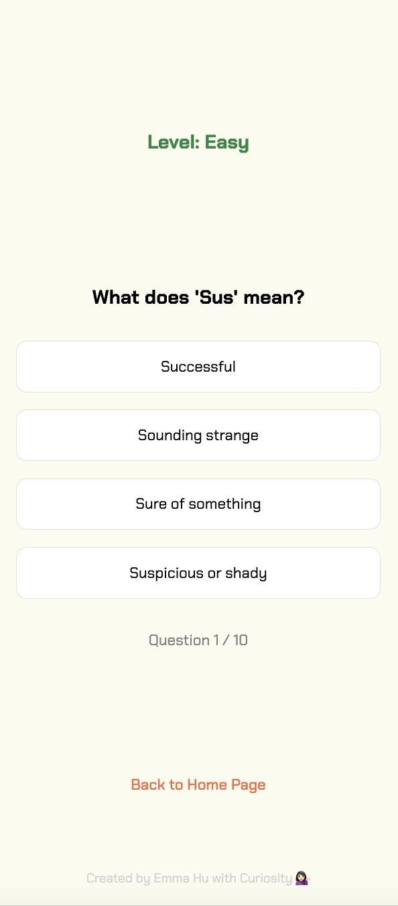
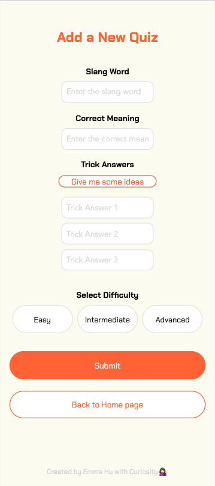
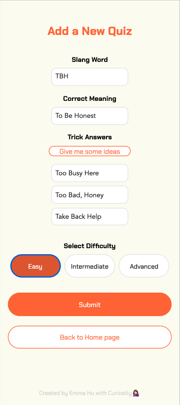
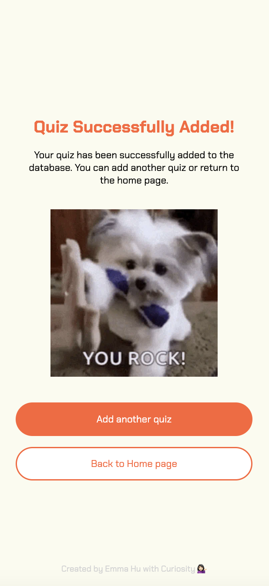

# Project Title

Z-Lingo

## Overview

Z-Lingo is an interactive web application that gamifies the learning experience for Boomers and Millennials, helping them assess and improve their understanding of Gen Z slangs. Users are presented with fun and challenging quizzes, allowing them to stay updated with the latest language trends of younger generations.

### Problem Space

Language evolves rapidly, and with each generation comes new slang and expressions. Boomers and Millennials often find themselves disconnected from Gen Z's communication styles, which can lead to misunderstandings and feelings of being out of touch. Z-Lingo addresses this gap by offering an entertaining platform where users can test their knowledge of Gen Z slang, learn new phrases, and improve their cultural literacy in a fun and engaging way. #NoMoreFOMO

### User Profile

Boomers and Millennials:

- Interested in understanding and keeping up with Gen Z slang.
- Looking for an enjoyable and educational experience.
- Competitive users who enjoy gamified learning experiences.

GenZ's:

- Looking to get up with their peers
- Interested in contributing their knowledge in latest language trends.

### Features

Phase 1 (MVP) features:

- As a user, I want to be presented with 10 multiple-choice questions featuring Gen Z slang terms so I can test my knowledge.
- As a user, I want to categorize quizzes by difficulty level to tailor my learning experience.
- As a user, I want to see my score immediately after completing the quiz so I can know how well I did.
- As a user, I want to contribute by adding new slang terms and creating quiz questions to enhance the content.

Phase 2 features:

- As a user, I want to see my ranking compared to other users to gauge my performance.
- As a user, I want to receive a "Gen Z Slang of the Day" to gradually expand my vocabulary.
- As a user, I want to sign up and log in to track my quiz history and progress over time.
- As a logged-in user, I want to access a leaderboard to see how I compare with others.

## Implementation

### Tech Stack

- Frontend: React.js
  - Client libraries:
    - react for building user interfaces.
    - react-router for client-side routing.
    - axios for HTTP requests.
- Backend: Express with Node.js
  - Server libraries:
    - knex
    - express
    - bcrypt for password hashing
- Database: MySQL for storing user data, quiz questions, and results.

### APIs

- Custom API: A custom-built API will manage user data, quiz content, scoring, and rankings.
- External API (Optional): An external API providing a repository of Gen Z slang and their definitions may be integrated to seed the quiz database. For the MVP, the content will primarily be internally curated.

### Sitemap

- Home Page: Introduction to Z-Lingo and a call-to-action to start the quiz.
- Quiz Page: Displays 10 multiple-choice questions for the user to answer.
- Results Page: Shows the user's score.
- Create A Quiz Page: Allows user to contribute new slang terms and create quiz questions to add to the quiz inventory.


### Mockups

#### Phase 1

#### Home Page


#### Quiz Page




#### Result Page


#### Add a Quiz Page






### Data


#### Relationships:
- Users → UserResponses:
    - One user can have many responses.
    - A foreign key (user_id) in the UserResponses table references the primary key (id) of the Users table.

- QuizQuestions → UserResponses:
    - One quiz question can have many user responses.
    - A foreign key (question_id) in the UserResponses table references the primary key (id) of the QuizQuestions table.

### Endpoints

| Method | Endpoint         | Purpose                                               |  Phase  |
| :----- | :--------------- | :---------------------------------------------------- | :-----: |
| GET    | /api/quiz        | Fetch a set of 10 quiz questions                      | Phase 1 |
| POST   | /api/quiz/submit | Submit quiz answers and get score and ranking         | Phase 1 |
| POST   | /api/quiz/add    | Allow users to add new slang terms and quiz questions | Phase 1 |
| GET    | /api/leaderboard | Fetch top-ranked users                                | Phase 2 |
| POST   | /api/auth/signup | Register a new user                                   | Phase 2 |
| POST   | /api/auth/login  | Log in an existing user                               | Phase 2 |

**GET /api/quiz**

- Fetch a set of 10 quiz questions based on optional filters (e.g. difficulty).

Parameters:

- Difficulty (optional): A string representing the difficulty level of the quiz (e.g., "Easy", "Intermediate", "Advanced").

Example Request (If `difficulty` is omitted):

- `GET /api/quiz`

Success Response (200):

```
[
    {
        "id": 1,
        "question": "What does 'no cap' mean?",
        "options": ["No lie", "No hat", "No joke", "No problem"],
        "correctOption": null,
        "difficulty": "Easy"
    },
    {
        "id": 2,
        "question": "What does 'FOMO' stand for?",
        "options": ["Fear of missing out", "Feeling of mustering out", "Fast out, move on", "Fun over, move out"],
        "correctOption": null,
        "difficulty": "Intermediate"
    }
]
```

Example Request (If `difficulty` is provided):

- `GET /api/quiz?difficulty=Intermediate`

Success Response (200):

```
[
        {
            "id": 1,
            "question": "What does 'no cap' mean?",
            "options": ["No lie", "No hat", "No joke", "No problem"],
            "correctOption": null,  // Correct option hidden from the user
            "difficulty": "Intermediate"
        },
        {
            "id": 2,
            "question": "What does 'sus' mean?",
            "options": ["Suspicious", "Sustainable", "Surprised", "Super"],
            "correctOption": null,
            "difficulty": "Intermediate"
        },
        {
            "id": 3,
            "question": "What does 'lit' mean?",
            "options": ["Exciting", "Burning", "Boring", "Dangerous"],
            "correctOption": null,
            "difficulty": "Easy"
        }
]
```

Error Response (500 - Internal Server Error):

- For any server-side issues when attempting to fetch quiz questions.

```
[
    {
        "error": "Unable to fetch quiz questions. Please try again later."
    },
    ...
]
```

**POST /api/quiz/submit**

- Submit quiz answers and return the score and ranking.

Parameters (Request Body):

- `answers`: An array of objects where each object contains:
  - `questionId`: The ID of the quiz question.
  - `selectedOption`: The user's chosen answer for that question.

Example Request Body:

```
{
    "answers": [
        { "questionId": 1, "selectedOption": "No lie" },
        { "questionId": 2, "selectedOption": "Suspicious" }
    ]
}
```

Success Response (200):

```
{
    "score": 2,  // Number of correct answers out of 10
    "ranking": "Top 10%",
    "correctAnswers": [
        { "questionId": 1, "correctOption": "No lie" },
        { "questionId": 2, "correctOption": "Suspicious" }
    ]
}
```

Error Response (400 - Bad Request):

```
{
    "error": "Invalid quiz submission. Please ensure all fields are correctly filled out."
}
```

**POST /api/quiz**

- Allow authenticated users to add new slang terms and create new quiz questions. This slang will be added to the quiz question database and used in future quizzes.

Parameters (Request Body):

- `slang`: The slang term to be added (e.g., "TBH").
- `options`: An array of exactly 4 possible meanings for the slang term.
- `correctOption`: The correct meaning of the slang (e.g., "To be honest"). The correct option must be one of the provided options.
- `difficulty`: The difficulty level of this question. Choose from "Easy", "Intermediate", and "Advanced"


Example Request Body:

```
{
    "slang": "TBH",
    "options": [
        "To be honest",
        "Too bad, huh?",
        "Take back home",
        "To be held"
    ],
    "correctOption": "To be honest",
    "difficulty": "Easy"

}
```

Success Response (201):

```
{
    "message": "Slang and quiz question successfully added.",
    "newSlang": {
        "id": 15,
        "slang": "TBH",
        "options": [
            "To be honest",
            "Too bad, huh?",
            "Take back home",
            "To be held"
        ],
        "correctOption": "To be honest",
        "difficulty": "Easy"
    }
}
```

Error Response (400 - Bad Request):

- When the correct option is not provided or is not one of the 4 provided options.
- When fewer or more than 4 options are provided.

```
{
    "error": "Invalid input. Correct option must be one of the 4 provided options."
}
```

Error Response (500 - Internal Server Error):

- For any server-side issues when attempting to add the new slang or quiz question.

```
{
    "error": "Unable to add slang term. Please try again later."
}
```

## Roadmap

- Project Setup

  - Set up the project repository and environment.
  - Create wireframes and mockups.
  - Search for an external API to get initial GenZ Slang data from

- Backend Development

  - Develop API endpoints for quizzes, user management, and scoring.

- Frontend Development

  - react project with routes and boilerplate pages
  - Build the React frontend and integrate with the backend API.
  - Implement the quiz UI and feedback system.
  - Implement basic navigation (home, quiz, results).

- Database Setup (Optional)
    - Set up the MySQL database schema.

- Testing and Finalization

  - Conduct user testing for functionality and UX feedback.
  - Fix any bugs and refine UI/UX.
  - Optimize the app for deployment.

- Demo

## Future  Implementations

- Desktop and Tablet responsive views
- Results with playing ranking: Shows the user's score, and their ranking compared to historical players.
- Screening of sensitive / inappropriate / violent words
- Daily Slang: Introduce a "Gen Z Slang of the Day" feature, providing users with a new slang term to learn each day.
- Authorization and User Login using JWT auth
  - Before adding auth, all API requests will be using a fake user with id 1
  - Added after core features have first been implemented
  - Store JWT in localStorage, remove when a user logs out
  - Add states for logged in showing different UI in places listed in mockups
- Profile Page: Displays the user's quiz history and personal statistics.
- Leaderboard Page: Displays top user scores and rankings by user profiles.
- Social Sharing: Add functionality for users to share their scores on social media platforms.
- Forgot password functionality
- Mobile App: Develop a mobile version of the app for iOS and Android to reach a broader audience.
